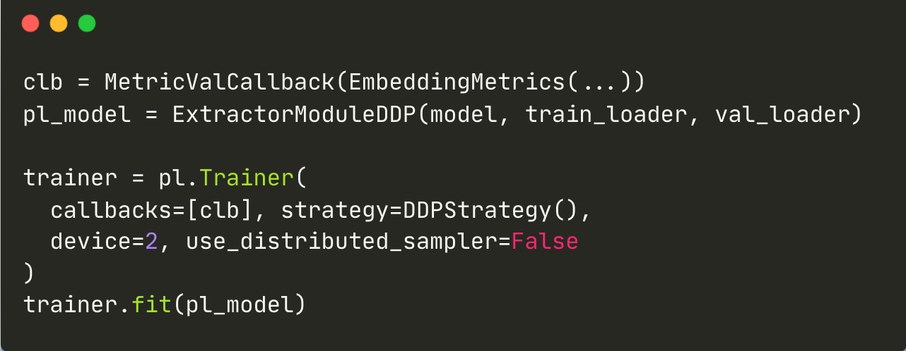

<table style="width: 100%; border-collapse: collapse; border-spacing: 0; margin: 0; padding: 0;">

<tr>
    <td style="border: 1px solid black; padding: 0;">

**Lightning**

[Full example](todo)

</td>

<td style="border: 1px solid black; padding: 0;">

**Lightning: Multi GPU**

[comment]: https://carbon.now.sh/?bg=rgba%28171%2C+184%2C+195%2C+1%29&t=monokai&wt=none&l=python&width=682&ds=true&dsyoff=20px&dsblur=68px&wc=true&wa=false&pv=56px&ph=56px&ln=false&fl=1&fm=Hack&fs=14px&lh=133%25&si=false&es=2x&wm=false&code=clb%2520%253D%2520MetricValCallback%28EmbeddingMetrics%28...%29%29%250Apl_model%2520%253D%2520ExtractorModuleDDP%28model%252C%2520train_loader%252C%2520val_loader%29%250A%250Atrainer%2520%253D%2520pl.Trainer%28%250A%2520%2520callbacks%253D%255Bclb%255D%252C%2520strategy%253DDDPStrategy%28%29%252C%250A%2520%2520device%253D2%252C%2520use_distributed_sampler%253DFalse%2520%2520%2520%2520%2520%2520%2520%2520%2520%2520%2520%2520%2520%2520%2520%2520%2520%2520%2520%2520%250A%29%250Atrainer.fit%28pl_model%29

[Full example](todo)

</td>
</tr>
<tr>
<td style="border: 1px solid black; padding: 0;">

TODO

</td>

<td style="border: 1px solid black; padding: 0;">

TODO

</td>

</tr>

</table>

 Category in train | Category in valid | Losses | Miners | Zoo | Pipelines | Samplers | Metrics

 Re-ranking | Re-ranking via NN (2 links)
 Lightning | Lightning Multi GPU
 Logging | PML (2 links)
