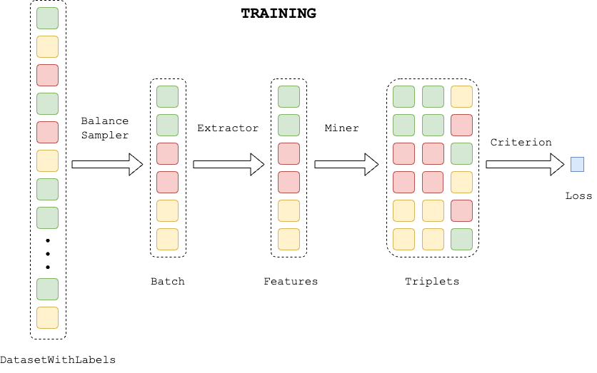
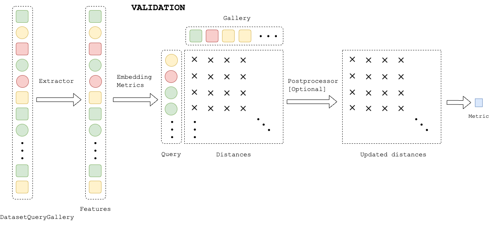

# FEATURES EXTRACTION PIPELINES

These pipelines allow you to train and validate models that represent images as feature vectors, aka feature extractors.
Basically, there are two pipelines:
* [extractor_training_pipeline](https://open-metric-learning.readthedocs.io/en/latest/contents/lightning.html#extractor-training-pipeline) including training and validation
* [extractor_validation_pipeline](https://open-metric-learning.readthedocs.io/en/latest/contents/lightning.html#extractor-validation-pipeline) for a stand-alone validation

**Training part** implies using losses, well-established for metric learning, such as the angular losses
(like *ArcFace*) or the contrastive losses (like *TripletLoss*).
The latter benefits from effective mining schemas of triplets/pairs, so we pay great attention to it.

Thus, **training part** consists of:
   1. Use [DataLoader](https://open-metric-learning.readthedocs.io/en/latest/contents/samplers.html) + [Sampler](https://open-metric-learning.readthedocs.io/en/latest/contents/samplers.html) to form batches.
   2. *[Only for losses based on combinations]* Use [Miner](https://open-metric-learning.readthedocs.io/en/latest/contents/miners.html) to form meaningful triplets.
   3. Compute [loss](https://open-metric-learning.readthedocs.io/en/latest/contents/losses.html), update gradients.

**Validation part** consists of:
  1. Accumulating all the embeddings in [EmbeddingMetrics](https://open-metric-learning.readthedocs.io/en/latest/contents/metrics.html#embeddingmetrics).
  2. Calculating distances between queries and galleries.
  3. *[Optional]* Applying some specific retrieval postprocessing [techniques](https://open-metric-learning.readthedocs.io/en/latest/contents/postprocessing.html).
  4. Calculating retrieval metrics like *CMC@k*, *Precision@k* or *MeanAveragePrecision@k*.

### Building blocks that can be changed:

|      Block       |                                                                                                                                     |       registry       |
|:----------------:|:-----------------------------------------------------------------------------------------------------------------------------------:|:--------------------:|
|  transforms val  |                                                                                                                                     | TRANSFORMS_REGISTRY  |
|      model       |   Must be a successor of [IExtractor](https://open-metric-learning.readthedocs.io/en/latest/contents/interfaces.html#iextractor)    |                      |
|     sampler      |                                                                                                                                     |                      |
|    criterion     |                     A criterion which takes `(features, labels)` as input and returns loss, see predifined ones                     |                      |
|    optimizer     |  PyTorch optimizer, see the predefined [configs](https://github.com/OML-Team/open-metric-learning/tree/main/oml/configs/optimizer)  |                      |
|   lr scheduler   |  PyTorch scheduler, see the predefined [configs](https://github.com/OML-Team/open-metric-learning/tree/main/oml/configs/scheduler)  |                      |

